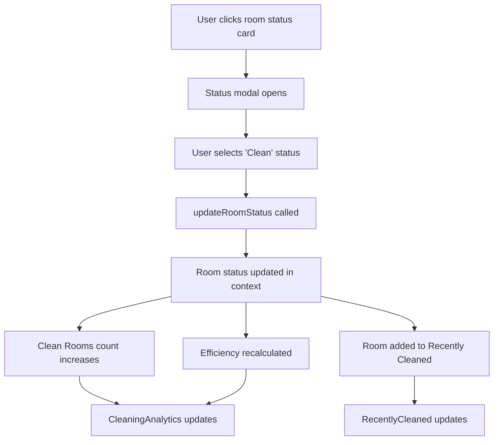

# Environmental Clean Room Status Tracking

## Overview

The Environmental Clean module now features real-time room status tracking with automatic dashboard updates and activity logging. When a room is marked as "Clean", the system automatically updates the Clean Rooms count in the analytics dashboard and adds the room to the Recently Cleaned activity tracker.

## Architecture

### Core Components

#### 1. RoomStatusContext (`src/pages/EnvironmentalClean/context/RoomStatusContext.tsx`)

- **Purpose**: Centralized state management for room status across all Environmental Clean components
- **Key Features**:
  - Shared room data with 20 sample rooms across different statuses
  - Automatic analytics calculation (clean rooms, dirty rooms, efficiency)
  - Recently cleaned rooms tracking
  - Real-time status updates

#### 2. RoomStatusSummary (`src/pages/EnvironmentalClean/components/ui/RoomStatusSummary.tsx`)

- **Purpose**: Displays room status cards and allows status updates
- **Features**:
  - Interactive status cards showing room counts by status
  - Clickable drawers to view rooms by status
  - Status update modal with keyboard navigation
  - Real-time updates when status changes

#### 3. CleaningAnalytics (`src/pages/EnvironmentalClean/components/ui/CleaningAnalytics.tsx`)

- **Purpose**: Displays cleaning metrics dashboard
- **Metrics**:
  - Clean Rooms count (auto-updates)
  - Dirty Rooms count (auto-updates)
  - Efficiency percentage (auto-calculated)

#### 4. RecentlyCleaned (`src/pages/EnvironmentalClean/components/ui/RecentlyCleaned.tsx`)

- **Purpose**: Shows recently cleaned rooms activity feed
- **Features**:
  - Scrollable list of recently cleaned rooms
  - Hover tooltips with cleaner name and timestamp
  - Auto-updates when new rooms are marked clean

## Data Flow



## Sample Data

### Initial Room Distribution

- **Dirty**: 4 rooms (1, 2, 3, 16)
- **In Progress**: 3 rooms (4, 5, 17)
- **Clean**: 6 rooms (6, 7, 8, 9, 10, 18)
- **Biohazard**: 2 rooms (11, 19)
- **Theft**: 2 rooms (12, 20)
- **Low Inventory**: 1 room (13)
- **Out of Service**: 1 room (14)
- **Public Areas**: 1 room (15)

### Analytics Calculations

- **Total Rooms**: 20
- **Clean Rooms**: 6 (30% efficiency)
- **Dirty Rooms**: 4
- **Efficiency**: 30%

## User Workflow

### 1. Viewing Room Status

1. Navigate to Environmental Clean page
2. View Room Status Summary cards showing counts by status
3. Click any status card to see detailed room list

### 2. Updating Room Status

1. Click on a status card (e.g., "Dirty")
2. Click "Update Status" button for a specific room
3. Select new status from modal (e.g., "Clean")
4. Click "Update" to confirm

### 3. Real-time Updates

- Clean Rooms count immediately increases
- Room appears in Recently Cleaned list
- Efficiency percentage recalculates
- All changes are reflected across all components

## Technical Implementation

### Context Structure

```typescript
interface RoomStatusContextType {
  rooms: Array<{ id: string; status: RoomStatusType }>;
  recentlyCleanedRooms: RecentlyCleanedRoom[];
  updateRoomStatus: (roomId: string, newStatus: RoomStatusType) => void;
  getCleanRoomsCount: () => number;
  getDirtyRoomsCount: () => number;
  getEfficiency: () => number;
}
```

### Status Types

```typescript
type RoomStatusType =
  | 'Available'
  | 'Dirty'
  | 'LowInventory'
  | 'Biohazard'
  | 'Theft'
  | 'InProgress'
  | 'Supervisor'
  | 'Isolation'
  | 'Quarantine'
  | 'OutOfService'
  | 'Unassigned'
  | 'PublicAreas'
  | 'Clean';
```

### Recently Cleaned Room Structure

```typescript
interface RecentlyCleanedRoom {
  room: string;
  cleanedAt: string;
  cleanedBy: string;
}
```

## Accessibility Features

- **Keyboard Navigation**: Full keyboard support for status cards and modals
- **Screen Reader Support**: ARIA labels and roles for all interactive elements
- **Focus Management**: Proper focus handling in modals and drawers
- **Color Contrast**: High contrast colors for status indicators

## Error Handling

- **Context Provider**: Throws error if used outside provider
- **Status Validation**: Ensures only valid status types are accepted
- **Data Consistency**: Maintains data integrity across all components

## Performance Considerations

- **Memoized Calculations**: Analytics calculations are memoized
- **Efficient Updates**: Only affected components re-render
- **Limited History**: Recently cleaned list limited to 10 items
- **Optimized Rendering**: Components use React.memo where appropriate

## Future Enhancements

### CX4 Level Improvements

1. **Real-time Notifications**: Push notifications when rooms are cleaned
2. **Advanced Analytics**: Trend analysis and predictive cleaning schedules
3. **Integration**: Connect with actual room management systems
4. **Audit Trail**: Complete history of all status changes
5. **Mobile Support**: Touch-optimized interface for mobile devices

### Settings Integration Opportunities

1. **Room Management**: Add/remove rooms from Settings
2. **Status Customization**: Allow custom status types
3. **Notification Preferences**: Configure when and how to notify users
4. **Analytics Thresholds**: Set efficiency targets and alerts
5. **User Permissions**: Control who can update room statuses

## Testing

### Manual Testing Checklist

- [ ] Status cards display correct counts
- [ ] Clicking status cards opens drawer
- [ ] Status update modal works correctly
- [ ] Clean rooms count updates immediately
- [ ] Recently cleaned list updates
- [ ] Efficiency calculation is accurate
- [ ] Keyboard navigation works
- [ ] Screen reader compatibility

### Automated Testing

- Unit tests for context functions
- Component integration tests
- Accessibility testing
- Performance testing

## Troubleshooting

### Common Issues

1. **Context not found**: Ensure components are wrapped in RoomStatusProvider
2. **Status not updating**: Check that updateRoomStatus is called correctly
3. **Analytics not calculating**: Verify room data structure
4. **Recently cleaned not updating**: Check if status is exactly 'Clean'

### Debug Information

- Console logs show status updates
- Context state can be inspected in React DevTools
- Room data structure is logged on initialization

## Related Documentation

- [Environmental Clean Supabase Integration](./ENVIRONMENTAL_CLEAN_SUPABASE_INTEGRATION.md)
- [Recently Cleaned Rooms Setup](./RECENTLY_CLEANED_ROOMS_SETUP.md)
- [Environmental Clean Module Overview](./ENVIRONMENTAL_CLEAN_README.md)
